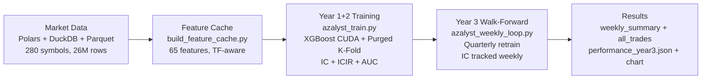

# Azalyst Alpha Research Engine

> An institutional-style quantitative research platform for crypto markets — built as a personal project. Not a hedge fund. Not a financial product. Just a passion for systematic research.

---


---

## What's New in v2

| Area | v1 | v2 |
|---|---|---|
| Features | 27 generic TA | **65 features** — WorldQuant alphas, Garman-Klass, ADX, Kyle lambda, Hurst, FFT |
| Training data | Year 1 only | **Year 1 + Year 2 combined** |
| Test set | Year 2+3 rolling | **Year 3 only** — strict out-of-sample |
| Retrain | Every week (OOM) | **Quarterly** — every 13 weeks, stable |
| Cross-validation | TimeSeriesSplit (leakage) | **Purged K-Fold** — 48-bar embargo |
| Scaler | StandardScaler | **RobustScaler** — handles fat tails |
| GPU backend | LightGBM CUDA (broken on Kaggle) | **XGBoost CUDA** — confirmed on T4 + RTX 2050 |
| Metrics | AUC only | **AUC + IC + ICIR** |
| Output | CSV | CSV + **charts + JSON summary** |

---

## Overview

Azalyst is research infrastructure for systematic crypto market study. It evaluates cross-sectional signals, trains predictive models, and validates the process with a strict walk-forward loop on unseen data.

The v2 architecture follows institutional quant fund methodology:
- **Train on known history** — Year 1 + Year 2
- **Test on unseen future** — Year 3, never touched during training
- **Retrain quarterly** as new data accumulates
- **Measure IC and ICIR** alongside AUC — not just win rate

---

## System Architecture



---

## Feature Engineering — 65 Features, 8 Categories

### 1. Returns (7)
`ret_1bar` `ret_1h` `ret_4h` `ret_1d` `ret_2d` `ret_3d` `ret_1w`

### 2. Volume (6)
`vol_ratio` `vol_ret_1h` `vol_ret_1d` `obv_change` `vpt_change` `vol_momentum`

### 3. Volatility (7)
`rvol_1h` `rvol_4h` `rvol_1d` `vol_ratio_1h_1d` `atr_norm` `parkinson_vol` `garman_klass`

Parkinson and Garman-Klass use the High/Low range — less noisy than close-to-close vol.

### 4. Technical (10)
`rsi_14` `rsi_6` `macd_hist` `bb_pos` `bb_width` `stoch_k` `stoch_d` `cci_14` `adx_14` `dmi_diff`

ADX measures trend strength. DMI diff gives directional bias.

### 5. Microstructure (6)
`vwap_dev` `amihud` `kyle_lambda` `spread_proxy` `body_ratio` `candle_dir`

Kyle lambda estimates price impact per unit volume — a genuine microstructure signal.

### 6. Price Structure (6)
`wick_top` `wick_bot` `price_accel` `skew_1d` `kurt_1d` `max_ret_4h`

### 7. WorldQuant-Inspired Alphas (8)
`wq_alpha001` `wq_alpha012` `wq_alpha031` `wq_alpha098` `cs_momentum` `cs_reversal` `vol_adjusted_mom` `trend_consistency`

### 8. Regime Features (5)
`vol_regime` `trend_strength` `corr_btc_proxy` `hurst_exp` `fft_strength`

Hurst exponent identifies trending vs mean-reverting states. FFT captures dominant price cycles.

---

## ML Pipeline

### Training Label — Cross-Sectional Alpha

The model predicts whether a coin will **outperform the cross-sectional median** return at the next 4H bar. Direction-agnostic — works in bull and bear markets equally. This is how institutional quant funds build signals.

IC (Information Coefficient) = Spearman rank correlation between predictions and actual returns. ICIR = IC / std(IC). Both tracked weekly.

### Purged K-Fold CV

Adds a 48-bar embargo between train and validation to prevent leakage:

```
|──── TRAIN ────| 48-bar gap |── VAL ──|
```

### Walk-Forward Architecture

```
Year 1 + Year 2 (730 days)
    ↓
[BASE MODEL]
XGBoost CUDA — Purged K-Fold (5 splits, gap=48)
RobustScaler — IC + ICIR + AUC
    ↓
Year 3 only (never seen during training)
    ↓
┌─────────────────────────────────────────────────────┐
│  Each week:                                         │
│    1. Predict  — rank symbols by outperformance prob│
│    2. Trade    — long top 15%, short bottom 15%     │
│    3. Evaluate — weekly IC + return + Sharpe        │
│    4. Retrain  — every 13 weeks (quarterly)         │
│    5. Save     — weekly summary + all trades        │
└─────────────────────────────────────────────────────┘
    ↓
performance_year3.json + performance_year3.png
```

---

## Execution Modes

### Option 1 — Kaggle (GPU T4, recommended)

1. Open `azalyst-alpha-research-engine.ipynb` on Kaggle → **Copy & Edit**
2. Settings → Accelerator → **GPU T4 x2**
3. Attach dataset `binance-data-5min-300-coins-3years`
4. Click **Run All**
5. Download `azalyst_v2_results.zip` from Output tab

Expected: **3–5 hours** on dual T4.

### Option 2 — Local GPU (RTX 2050 / any NVIDIA)

```bash
# Verify GPU works first
python azalyst_local_gpu.py

# Build feature cache (run once)
python build_feature_cache.py --data-dir ./data --out-dir ./feature_cache

# Train Year 1+2
python azalyst_train.py --feature-dir ./feature_cache --out-dir ./results --gpu

# Walk-forward Year 3
python azalyst_weekly_loop.py --feature-dir ./feature_cache --results-dir ./results --gpu
```

See `SETUP_LOCAL_GPU.md` for RTX 2050 4GB VRAM tuning guide.

### Option 3 — CPU only

Same commands above without `--gpu`. Uses all CPU cores automatically.

### Option 4 — GitHub Actions (automated CI/CD)

Push to `main` — runs automatically on Kaggle. Set three repo secrets:

| Secret | Value |
|---|---|
| `KAGGLE_USERNAME` | Your Kaggle username |
| `KAGGLE_KEY` | Kaggle API key |
| `KAGGLE_DATASET` | `username/dataset-name` |

### Option 5 — Core research pipeline

```bash
python azalyst_orchestrator.py --data-dir ./data --out-dir ./azalyst_output
python walkforward_simulator.py
```

---

## Bug Fixes

### v1.1 — Timeframe-Aware Feature Engineering

**Problem:** Rolling windows hardcoded to 5-min math (`BARS_PER_DAY = 288`). Scoring daily/weekly candles caused complete NaN flooding.

**Fix:** `azalyst_tf_utils.py` — `get_tf_constants(resample_str)` derives all window sizes dynamically.

```python
get_tf_constants('5min')  → bph=12,  bpd=288,  horizon=48
get_tf_constants('4h')    → bph=1,   bpd=6,    horizon=1
get_tf_constants('1D')    → bph=1,   bpd=1,    horizon=1
```

---

## Repository Map

| File | Purpose |
|---|---|
| `azalyst-alpha-research-engine.ipynb` | **Kaggle v2 notebook** — 65 features, XGBoost GPU, purged CV |
| `build_feature_cache.py` | Precompute 65 features — 5-20x speedup |
| `azalyst_train.py` | Train Year 1+2 — XGBoost CUDA, Purged K-Fold, IC+ICIR |
| `azalyst_weekly_loop.py` | Walk-forward Year 3 — quarterly retrain, IC weekly |
| `azalyst_local_gpu.py` | **NEW** — GPU test + benchmark for local NVIDIA |
| `SETUP_LOCAL_GPU.md` | **NEW** — RTX 2050 4GB VRAM setup guide |
| `azalyst_alpha_metrics.py` | IC, ICIR, Sharpe, drawdown metrics |
| `azalyst_tf_utils.py` | Timeframe-aware bar count utilities |
| `azalyst_factors_v2.py` | 65 cross-sectional factor library |
| `azalyst_engine.py` | Data loading, IC research, backtest engine |
| `azalyst_ml.py` | Regime detection, pump/dump detector |
| `azalyst_statarb.py` | Cointegration scanner |
| `azalyst_risk.py` | Portfolio optimization — MVO, HRP, Black-Litterman |
| `azalyst_alphaopt.py` | Ridge/ElasticNet optimal factor combination |
| `azalyst_orchestrator.py` | End-to-end research pipeline |
| `azalyst_validator.py` | Fama-MacBeth, Newey-West, BH correction |
| `azalyst_signal_combiner.py` | Regime-adaptive signal fusion |
| `azalyst_benchmark.py` | BTC buy-and-hold + equal-weight benchmarks |
| `azalyst_tearsheet.py` | Factor tear sheet generator |
| `azalyst_report.py` | Research report + live signal scanner |
| `walkforward_simulator.py` | Rolling walk-forward with checkpoints |
| `monitor_dashboard.py` | Browser-based live monitor (`http://127.0.0.1:8080`) |
| `Azalyst_Live_Monitor.ipynb` | Jupyter live monitor |
| `kaggle_pipeline.py` | Kaggle GPU pipeline runner |
| `azalyst_data.py` | Polars + DuckDB data layer |
| `azalyst_execution.py` | Order book, smart order routing, VWAP/TWAP |
| `azalyst_auditor.py` | Binance copy-trader strategy auditor |
| `.github/workflows/azalyst_training.yml` | GitHub Actions CI/CD |
| `SETUP.md` | Kaggle and GitHub Actions setup |

---

## Primary Outputs

| File | Description |
|---|---|
| `results/weekly_summary_year3.csv` | Week-by-week return, IC, Sharpe — Year 3 out-of-sample |
| `results/all_trades_year3.csv` | Every simulated trade |
| `results/performance_year3.json` | Annual return, Sharpe, IC, ICIR, win rate |
| `results/performance_year3.png` | 4-panel chart: returns, distribution, IC series, trade P&L |
| `results/feature_importance_base.csv` | Feature importance from base model |
| `results/models/model_base_y1y2.json` | Base XGBoost model (Y1+Y2) |
| `results/models/model_y3_week*.json` | Quarterly retrained models |

---

## How to Interpret Results

Send these to Claude after a run:
1. `performance_year3.json`
2. `weekly_summary_year3.csv`
3. `feature_importance_base.csv`

| Metric | Acceptable | Good | Strong |
|---|---|---|---|
| IC | > 0.01 | > 0.03 | > 0.05 |
| ICIR | > 0.2 | > 0.5 | > 1.0 |
| Sharpe | > 0.3 | > 0.7 | > 1.5 |
| IC % positive | > 52% | > 58% | > 65% |

---

## Data Requirements

Place Binance 5-minute parquet files in `data/`:

```text
timestamp | open | high | low | close | volume
```

## Installation

```bash
pip install -r requirements.txt
```

For local GPU:
```bash
pip install xgboost --upgrade
python azalyst_local_gpu.py
```

---

## Research Principles

- Transparent methodology over opaque claims
- Train/test split enforced strictly — Year 3 never touched during training
- Repeatable pipelines over discretionary workflows
- Results treated as evidence, not promises
- No LLM in the training loop — pure quantitative self-improvement

## Disclaimer

Azalyst is a personal research and learning project. Not financial advice. Use at your own risk.

---

<div align="center">
Built by <a href="https://github.com/gitdhirajsv">Azalyst</a>
</div>

