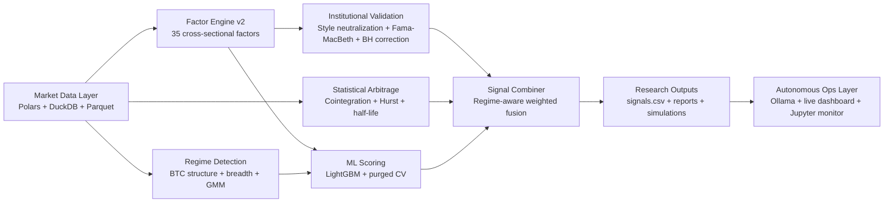

# Azalyst Alpha Research Engine

> Institutional-style quantitative research infrastructure for crypto markets.
> Built as a personal research platform for systematic signal discovery, validation, simulation, and autonomous monitoring.
>
> Not a hedge fund. Not a brokerage. Not financial advice.

---


## Executive Overview

Azalyst is a full-stack quantitative research environment for crypto markets. The platform ingests multi-year Binance OHLCV data, builds cross-sectional factor libraries, neutralizes systematic exposures, evaluates statistical arbitrage opportunities, trains regime-aware machine learning models, and validates everything with walk-forward simulation.

The goal is simple: treat crypto research with the discipline of an institutional quant workflow rather than chart-based intuition.

## What the Platform Does

- Ingests large universes of Binance 5-minute parquet data across hundreds of symbols.
- Builds 35 cross-sectional crypto-native factors spanning momentum, reversal, volatility, liquidity, microstructure, and technical structure.
- Applies institutional validation, including style neutralization, Fama-MacBeth cross-sectional regressions, and false discovery rate control.
- Scans for cointegrated pairs and mean-reversion opportunities.
- Trains LightGBM-based predictive models with purged time-series cross-validation and regime classification.
- Replays the strategy with rolling walk-forward simulation, checkpointing, and performance logging.
- Provides an autonomous local operating layer powered by Ollama, a live dashboard, and a Jupyter notebook monitor.

## Research Architecture



## Research Workflow

### 1. Data Loading

**Technical view**
- Parallel parquet ingestion via `ProcessPoolExecutor`.
- Wide close and volume panels built with Polars lazy scans and DuckDB cross-sectional queries.
- Timestamp normalization and optional resampling from 5-minute to higher intervals.

**Practical view**
- Reads the raw Binance history and turns it into a research-ready market panel for every downstream component.

### 2. Factor Research

**Technical view**
- `FactorEngineV2` computes 35 cross-sectional factors.
- `CrossSectionalAnalyser` measures Spearman IC, ICIR, Newey-West adjusted t-stats, and decay across forward horizons from 1 hour to 1 week.

**Practical view**
- Tests whether ideas such as momentum persistence, mean reversion, liquidity stress, or volatility premia hold up across the full universe.

| Factor family | Examples | Research objective |
| --- | --- | --- |
| Momentum | `MOM_1H` to `MOM_30D`, `OVERNIGHT` | Persistence of relative strength |
| Reversal | `REV_1H`, `REV_4H`, `REV_1D` | Short-horizon snapback behavior |
| Volatility | `DOWNVOL_1W`, `RVOL_1D`, `VOL_OF_VOL` | Risk premia and downside asymmetry |
| Liquidity | `AMIHUD`, `CORWIN_SCHULTZ`, `TURNOVER` | Trading frictions and participation |
| Microstructure | `MAX_RET`, `SKEW_1W`, `KURT_1W`, `BTC_BETA` | Hidden structure and systematic dependency |
| Technical | `TREND_48`, `BB_POS`, `RSI_RANK`, `MA_SLOPE` | Ranked classical patterns |

### 3. Institutional Validation

**Technical view**
- `FactorValidator` neutralizes BTC beta, size, and liquidity exposures.
- Cross-sectional Fama-MacBeth regressions measure whether alpha survives after de-biasing.
- Benjamini-Hochberg correction controls the false discovery rate.

**Practical view**
- Filters out signals that are only disguised beta, size, or noise.

### 4. Statistical Arbitrage

**Technical view**
- Engle-Granger two-step cointegration tests across symbol pairs.
- Hurst exponent and half-life validation for mean-reverting spreads.
- Live z-score monitoring for divergence and convergence setups.

**Practical view**
- Looks for linked assets that temporarily drift apart and may revert.

### 5. Machine Learning Layer

**Technical view**
- `azalyst_ml.py` uses LightGBM with optional CUDA acceleration.
- Purged time-series cross-validation reduces lookahead bias.
- Core models include:
  - `PumpDumpDetector`: classification model for pump-like preconditions.
  - `ReturnPredictor`: directional 4-hour forward return model.
  - `RegimeDetector`: Gaussian Mixture Model for Bull, Bear, High-Vol, and Quiet regimes.

**Practical view**
- Lets the research stack adapt to changing market structure instead of relying on a single static rule set.

### 6. Walk-Forward Simulation

**Technical view**
- Rolling train-test windows with retraining every 30 days.
- Feature scaling fit only on training rows.
- Entries simulated at the next bar open with taker fees and checkpoint-based resume support.

**Practical view**
- Replays the strategy as if it had been running live through history.

## Autonomous Research Stack

Azalyst includes a local operating layer for hands-off runs and real-time visibility.

### Components

- `RUN_SHIFT_MONITOR.bat`: one-click launcher for the monitor and autonomous team.
- `azalyst_autonomous_team.py`: local multi-agent research runner with lock protection and live simulator streaming.
- `monitor_dashboard.py`: local browser dashboard at `http://127.0.0.1:8080`.
- `Azalyst_Live_Monitor.ipynb`: Jupyter notebook view for live monitoring.
- `ensure_jupyter_monitor.py`: starts or reconnects to the notebook server automatically.
- `cleanup_locks.py`: clears stale launcher locks without touching checkpoints.
- Ollama + `deepseek-r1:14b`: local LLM runtime used by the autonomous research workflow.

### What You See During a Run

- Live simulator status in the main console.
- Real ML training progress streamed from the child process.
- Browser dashboard with process health, checkpoint state, latest metrics, and log tail.
- Jupyter notebook monitor for shift-style viewing.
- Resume support through `checkpoint.json` if a run is interrupted.

## Repository Map

| Path | Purpose |
| --- | --- |
| `azalyst_orchestrator.py` | End-to-end research pipeline entry point. |
| `azalyst_data.py` | High-performance Polars and DuckDB data layer. |
| `azalyst_factors_v2.py` | Factor library with cross-sectional crypto signals. |
| `azalyst_validator.py` | Style neutralization and institutional validation. |
| `azalyst_statarb.py` | Cointegration and mean-reversion research. |
| `azalyst_ml.py` | ML models, feature engineering, and regime logic. |
| `azalyst_signal_combiner.py` | Weighted signal fusion layer. |
| `walkforward_simulator.py` | Rolling walk-forward backtest and checkpointing. |
| `azalyst_autonomous_team.py` | Autonomous local research runner. |
| `monitor_dashboard.py` | Live browser monitor server. |
| `Azalyst_Live_Monitor.ipynb` | Notebook-based live monitor. |
| `RUN_SHIFT_MONITOR.bat` | One-click Windows launcher. |
| `autonomous_stack_docs/` | Supporting architecture, workflow, quickstart, and disclaimer docs. |
| `azalyst_output/` | Signals, metrics, reports, and generated research artifacts. |

## Data Requirements

Place Binance 5-minute parquet files in `data/` with this schema:

```text
timestamp | open | high | low | close | volume
```

The platform is designed for large cross-sectional universes and performs best with deep historical coverage.

## Quickstart

### 1. Install Python dependencies

```bash
pip install -r requirements.txt
```

### 2. Optional: install notebook monitoring support

```bash
pip install notebook ipykernel
```

### 3. Install and prepare Ollama

Install Ollama locally, then pull the model used by the autonomous runner:

```bash
ollama pull deepseek-r1:14b
```

### 4. Add market data

Drop your Binance parquet files into `data/`.

### 5. Launch the platform

**Windows autonomous workflow**

```text
Double-click RUN_SHIFT_MONITOR.bat
```

This will:
- start the live dashboard,
- open the Jupyter monitor when available,
- start or reconnect to Ollama,
- warm the local model, and
- run the autonomous research team.

**Manual research pipeline**

```bash
python azalyst_orchestrator.py --data-dir ./data --out-dir ./azalyst_output
```

## Key Outputs

| File | Description |
| --- | --- |
| `signals.csv` | Ranked per-symbol signal output. |
| `performance_metrics.csv` | Win rate, Sharpe, drawdown, and simulation metrics. |
| `paper_trades.csv` | Simulated trade blotter. |
| `checkpoint.json` | Resume point for interrupted walk-forward runs. |
| `team_log.txt` | Autonomous runner transcript and simulator stream. |

## Documentation Bundle

The companion docs live in `autonomous_stack_docs/`:

- `Architecture.md`
- `ResearchWorkflow.md`
- `ModuleIndex.md`
- `Quickstart.md`
- `Disclaimer.md`
- `README.md`

These files provide a portable narrative version of the platform design and operating flow.

## Design Principles

- Favor repeatable research over one-off chart opinions.
- Separate raw signal discovery from validation and execution realism.
- Minimize lookahead bias with purged CV and walk-forward simulation.
- Keep the operating layer local-first using Ollama, dashboard monitoring, and Jupyter.
- Treat outputs as research artifacts first, not product promises.

## Disclaimer

Azalyst is a personal research and learning project. It is not an investment product, not a trading service, and not financial advice. Any use of the code, models, or outputs is entirely at your own risk.

---

<div align="center">
Built by <a href="https://github.com/gitdhirajsv">Azalyst</a>
</div>
