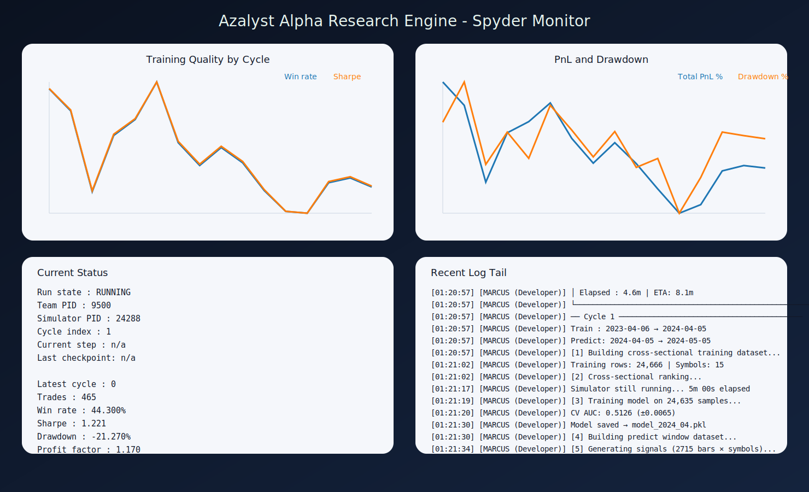
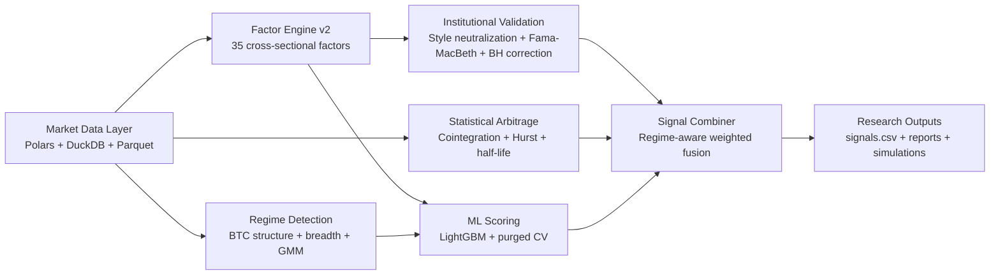

# Azalyst Alpha Research Engine

> An institutional-style quantitative research platform for crypto markets - built as a personal project. Not a hedge fund. Not a financial product. Just a passion for systematic research.

---


## Overview

Azalyst Alpha Research Engine is research infrastructure for systematic crypto market study. It is built to evaluate cross-sectional signals, neutralize obvious risk exposures, test mean-reversion and regime effects, train predictive models, and validate the resulting process with walk-forward simulation.

The project is structured as a research environment rather than a product surface. It is designed for repeatable experimentation, auditability, and transparent methodology. The emphasis is on whether an observed effect survives disciplined validation, not on maximizing narrative appeal or alert volume.

## Live Research Monitor

The platform includes a local monitoring layer for long-running walk-forward experiments. The Spyder view below is generated from the same run artifacts that drive the autonomous workflow.



## Research Scope

The platform is built around five core questions:

1. Which cross-sectional factors persist across a broad crypto universe?
2. Which signals survive after controlling for systematic exposures such as BTC beta, liquidity, and size?
3. Which relationships exhibit genuine mean reversion rather than coincidental co-movement?
4. Can machine learning models improve ranking quality without introducing obvious lookahead bias?
5. Does the full process remain credible under rolling walk-forward replay with checkpoints, fees, and retraining?

## System Architecture



## Research Pipeline

### 1. Data Loading
- Parallel parquet ingestion with `ProcessPoolExecutor`.
- Wide close and volume panels built with Polars lazy scans and DuckDB cross-sectional queries.
- Timestamp normalization and optional interval aggregation.

### 2. Factor Research
- `FactorEngineV2` computes 35 cross-sectional factors.
- `CrossSectionalAnalyser` evaluates Spearman rank IC, ICIR, Newey-West adjusted t-stats, and decay from 1 hour to 1 week.
- Signal families include momentum, reversal, volatility, liquidity, microstructure, and ranked technical structure.

### 3. Institutional Validation
- `FactorValidator` removes BTC beta, liquidity, and size effects.
- Cross-sectional Fama-MacBeth regressions test whether alpha persists after de-biasing.
- Benjamini-Hochberg correction controls false discovery risk.

### 4. Statistical Arbitrage
- Engle-Granger two-step cointegration testing across symbol pairs.
- Hurst exponent and half-life validation for mean-reverting spreads.
- Live z-score computation for spread dislocations.

### 5. Machine Learning
- `azalyst_ml.py` trains LightGBM models with optional CUDA acceleration.
- Purged time-series cross-validation is used to reduce leakage.
- Core model families include `PumpDumpDetector`, `ReturnPredictor`, and `RegimeDetector`.

### 6. Walk-Forward Simulation
- Rolling train-test windows with periodic retraining.
- Feature transforms fit only on training rows.
- Resume support through checkpoints and logging.
- Trade replay with next-bar execution assumptions and fee handling.

## Execution Modes

### Option 1 - Run the core research and ML pipeline only

Use this mode when you want the research engine itself without the autonomous Ollama layer.

**End-to-end research pipeline**

```bash
python azalyst_orchestrator.py --data-dir ./data --out-dir ./azalyst_output
```

**Direct walk-forward simulation**

```bash
python walkforward_simulator.py
```

This path is appropriate when the objective is direct factor research, model training, and simulation without an LLM-driven operating loop.

### Option 2 - Run with Ollama, Jupyter, and the autonomous research loop

Use this mode when you want the local LLM-assisted workflow to monitor the run, surface progress, and support iterative fixing.

```text
RUN_SHIFT_MONITOR.bat
```

This mode starts:
- the live browser dashboard,
- the Jupyter monitor notebook when available,
- the local Ollama runtime,
- the model warm-up process, and
- the autonomous research team around the simulator.

If you want the same autonomous backend with a Spyder-first monitoring surface instead of browser or notebook tabs, use:

```text
RUN_SPYDER_SHIFT_MONITOR.bat
```

## Local Research Operations Layer

The autonomous operating layer is local-first and built to support long-running experiments.

- `RUN_SHIFT_MONITOR.bat` launches the monitored workflow.
- `RUN_SPYDER_SHIFT_MONITOR.bat` launches the Spyder-first monitored workflow.
- `azalyst_autonomous_team.py` manages the multi-agent local research loop.
- `monitor_dashboard.py` serves the live dashboard at `http://127.0.0.1:8080`.
- `Azalyst_Live_Monitor.ipynb` provides a notebook-based monitoring surface.
- `spyder_live_monitor.py` renders live charts, metrics, and log tails inside Spyder.
- `ensure_jupyter_monitor.py` reconnects or opens the notebook monitor.
- `cleanup_locks.py` clears stale launcher locks without deleting checkpoints.

## Repository Map

| Path | Purpose |
| --- | --- |
| `azalyst_orchestrator.py` | End-to-end research pipeline entry point. |
| `azalyst_data.py` | High-performance Polars and DuckDB analytics layer. |
| `azalyst_factors_v2.py` | Cross-sectional factor library. |
| `azalyst_validator.py` | Style neutralization and institutional validation. |
| `azalyst_statarb.py` | Cointegration and mean-reversion research. |
| `azalyst_ml.py` | Predictive models, feature engineering, and regime logic. |
| `azalyst_signal_combiner.py` | Weighted signal fusion layer. |
| `walkforward_simulator.py` | Rolling walk-forward backtest and checkpointing. |
| `azalyst_autonomous_team.py` | Local autonomous research runner. |
| `monitor_dashboard.py` | Browser-based monitor server. |
| `Azalyst_Live_Monitor.ipynb` | Jupyter-based live monitor. |
| `azalyst_output/` | Signals, metrics, reports, and generated research artifacts. |

## Data Requirements

Place Binance 5-minute parquet files in `data/` with the schema below:

```text
timestamp | open | high | low | close | volume
```

The platform is intended for broad, cross-sectional research universes and multi-year history.

## Installation

### Python dependencies

```bash
pip install -r requirements.txt
```

### Optional notebook monitoring support

```bash
pip install notebook ipykernel
```

### Local Ollama model

```bash
ollama pull deepseek-r1:14b
```

## Primary Outputs

| File | Description |
| --- | --- |
| `signals.csv` | Ranked per-symbol research output. |
| `performance_metrics.csv` | Win rate, Sharpe, drawdown, and simulation metrics. |
| `paper_trades.csv` | Simulated trade log. |
| `checkpoint.json` | Resume point for interrupted walk-forward runs. |
| `team_log.txt` | Autonomous runner transcript and simulator stream. |

## Research Principles

- Transparent methodology over opaque claims.
- Validation before interpretation.
- Repeatable pipelines over discretionary workflows.
- Local-first operations for long-running experimentation.
- Research outputs treated as evidence, not promises.

## Disclaimer

Azalyst is a personal research and learning project. It is not a financial service, not a trading product, and not investment advice. Any use of the code, models, or outputs is entirely at the user's own risk.

---

<div align="center">
Built by <a href="https://github.com/gitdhirajsv">Azalyst</a>
</div>
